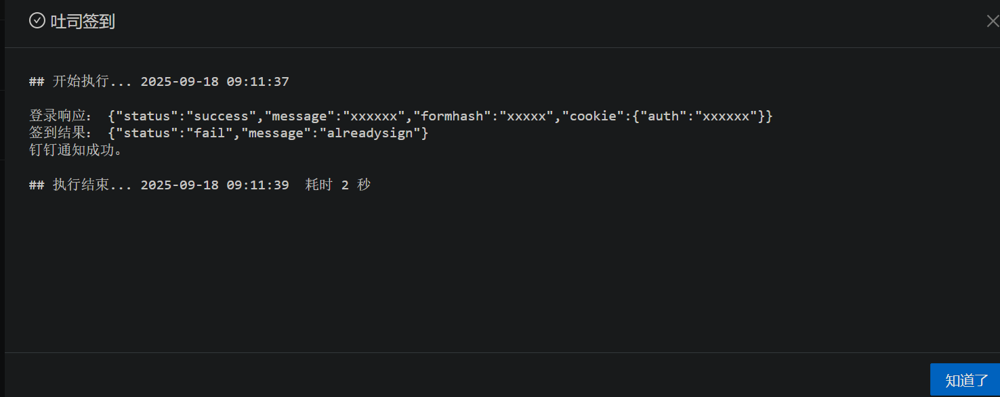
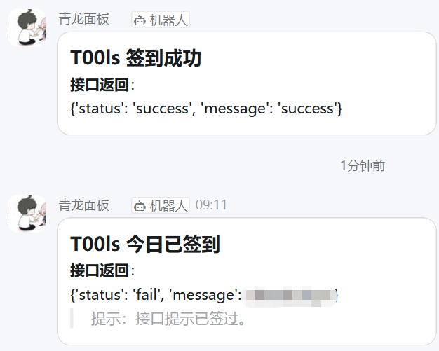

# 吐司论坛签到脚本（青龙面板版本）

## 用法

1. 青龙面板脚本导入  
2. 定时任务添加脚本 `toolsqiandao.py`  
3. 配置环境变量  

| 环境变量           | 说明                                  |
| ------------------ | ------------------------------------- |
| `T00LS_USERNAME`   | 用户名                                |
| `T00LS_PASSWORD`   | 密码（明文）                          |
| `T00LS_QUESTIONID` | 你设置的问题类型参数（打开 F12 可见） |
| `T00LS_ANSWER`     | 问题答案                              |
| `DD_ACCESS_TOKEN`  | 钉钉机器人触发参数                    |

4. 定时运行即可  

---

## 运行截图

  
  

---

## 致谢
此脚本二改自国光师傅的项目：  
👉 [https://www.t00ls.com/viewthread.php?tid=74149](https://www.t00ls.com/viewthread.php?tid=74149)  

原版在我环境中运行报错，所以做了一些改动。
